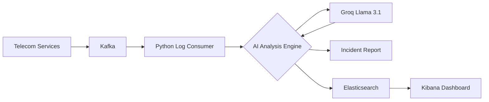

# Telecom Log AI Analyzer: Root Cause Analysis Suite

## Project Overview
This project demonstrates a production-grade AI-powered log analysis pipeline designed for **Telecom Network Monitoring**. Leveraging Large Language Models (LLMs), specifically **Groq's Llama 3.1 8b**, this suite automates the detection of anomalies, identification of root causes (RCA), and generation of remediation strategies for critical infrastructure components like Kafka and Elasticsearch.

## Business Problem Statement
In large-scale telecom environments, system logs generate millions of events per second. SRE and Data Engineering teams often struggle with "alert fatigue," where critical errors (e.g., Kafka consumer lag) are buried under routine informational logs. Manual RCA during an outage is time-consuming and prone to human error, leading to increased Mean Time To Recovery (MTTR).

## Objectives
- **Automated RCA**: Reduce manual effort in diagnosing log-based errors.
- **Severity Classification**: Automatically categorize incidents to prioritize response.
- **Actionable Remediation**: Provide step-by-step recovery instructions for on-call engineers.
- **Observability Integration**: Scaffolding for a broader Kafka → Python → ELK architecture.

## End-to-End Architecture
The conceptual architecture follows a modern data observability pattern:
1. **Source**: Telecom Services producing logs.
2. **Ingestion**: Kafka topics collecting log streams.
3. **Processing**: Python-based Consumer (this project) pulls logs.
4. **AI Layer**: Groq API (Llama 3.1 8b) performs semantic analysis.
5. **Storage/Visualization**: Elasticsearch & Kibana for long-term storage and dashboarding.

## Implementation Workflow
1. **Log Simulation**: Creation of `app.log` with realistic error patterns (Kafka lag, Timeout).
2. **AI Integration**: Python utility `groq_util.py` interfaces with Groq's high-speed inference engine.
3. **Prompt Engineering**: Specialized system prompts to ensure the LLM acts as a Senior SRE.
4. **Report Generation**: Outputting structured markdown reports for incident summaries.

## Data Layers (Medallion Architecture)
- **Bronze**: Raw `app.log` files containing unstructured text.
- **Silver**: Parsed and filtered logs identifying only ERROR and WARN levels.
- **Gold**: AI-generated insights and incident summaries ready for management review.

## Security & Scalability
- **Security**: API keys are managed via `.env` files and strictly excluded from version control using `.gitignore`.
- **Scalability**: The use of Groq's Llama 3.1 8b allows for near-instantaneous analysis (sub-second inference) even under high log volumes.
- **Error Handling**: Implemented idempotent logic and robust exception handling for API failures.

## Testing Strategy
- **Unit Testing**: Python scripts are verified for log parsing accuracy.
- **Prompt Testing**: Iterative refinement of system messages to ensure zero "hallucinations" in RCA.
- **Integration Testing**: End-to-end verification of the `.env` → `groq_util.py` → `analysis_report.md` flow.

## Cost Optimization
- **Model Selection**: Using Llama 3.1 8b via Groq offers an order of magnitude cost reduction compared to GPT-4o while maintaining high accuracy for structured log parsing.
- **Token Efficiency**: Pre-filtering logs (Silver layer) ensures we only send relevant error context to the LLM, minimizing token consumption.

## CI/CD Integration
The pipeline is designed to be integrated into GitHub Actions or GitLab CI:
- **On Push**: Automatically run lints and unit tests.
- **On Incident**: Triggered via webhook from Grafana/Kibana to generate instant RCA reports in PR comments.

---
*Developed as part of the GenAI Data Engineering Suite.*
